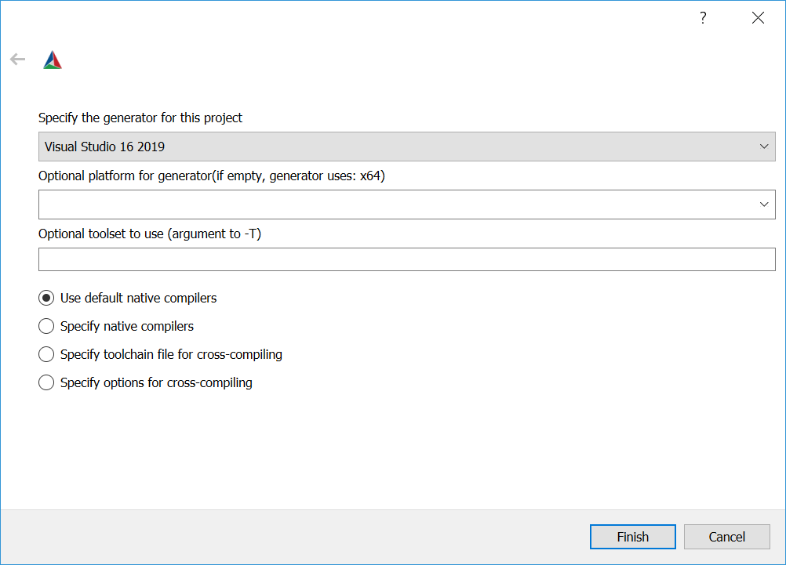

# Building OpenKit C/C++

## Build requirements

The following section describes the required programs and libraries.

### Required programs

The following programs need to be available to build OpenKit C/C++.

* CMake (https://cmake.org/)
  * any version >= 3.4.0
* A C++11 compliant compiler, like
  * Visual Studio 2015
  * Visual Studio 2017
  * Visual Studio 2019
  * GCC (>= 5.0.0)
  * Clang (>= 3.8.0)

### Optional programs

When building the Doxygen API documentation the following programs are
additionally required.

* Doxygen (http://www.stack.nl/~dimitri/doxygen/)

### Required libraries

OpenKit C/C++ depends on various 3rd party libraries, which are all included
and build when building OpenKit.
A lisf of libraries, including the versions and licenses are documented in the
[README.md](../README.md#included-3rd-party-libraries).

Since OpenKit communicates to the Dynatrace backend via HTTPS,
libcurl requires an SSL library.  
OpenKit has the following restrictions on supported SSL libraries:
* OpenSSL when OpenKit is built on GNU/Linux systems
* Microsoft's Secure Channel when OpenKit is built on Microsoft Windows
* DarwinSSL when OpenKit is built on macOS

During development the developer using OpenKit has to ensure that the appropriate
development library is available. The runtime library needs to be installed on
the system where the application using OpenKit is used.

## Options controlling the build

The following CMake options can be changed to customize the build.

| Option Name | Description | Default Value |
| ----------- | ----------- | ------------- | 
| BUILD_SHARED_LIBS | Build shared libraries (DLL/SO) | OFF |
| OPENKIT_FORCE_SHARED_CRT | Use shared (DLL) run-time lib even when OpenKit is built as static lib | OFF |
| OPENKIT_BUILD_TESTS | Build OpenKit tests | ON |
| BUILD_DOC | Create and install the HTML based API documentation (requires Doxygen) | OFF |
| OPENKIT_MONOLITHIC_SHARED_LIB | Build OpenKit dependencies as static lib and link them into a single DLL/SO | ON if BUILD_SHARED_LIBS is ON |

The option `OPENKIT_FORCE_SHARED_CRT` only has effect when building with
Visual Studio and only if `BUILD_SHARED_LIBS` is set to `OFF`.
When `OPENKIT_FORCE_SHARED_CRT` is set to `ON` this will pass `/MD` (`/MDd` for Debug builds) instead
of `/MT` (or `/MTd` for Debug builds) to the compiler. Please set the flags
accordingly when using static libraries, otherwise linker errors will occur.  

Note: When OpenKit is built as shared library (DLL/SO) all direct dependencies
(zlib, curl) will be shared libraries too (unless `OPENKIT_MONOLITHIC_SHARED_LIB` is specified).
When built as static libraries, all direct dependencies will be built as static libraries.
When building a shared library and `OPENKIT_MONOLITHIC_SHARED_LIB` is set to `ON`, all
direct dependencies are built as static library and linked into OpenKit DLL/SO.

## Building OpenKit

### Build using CMake GUI

One of the most convenient ways is to build OpenKit by invoking the CMake GUI.
A GUI exists on Windows, as well as GNU/Linux.

Do the following steps
1. Start the GUI
2. Choose the source folder where OpenKit C/C++ is located
3. Choose a build folder - This must not be the same as the source, but can be a subdirectory.
Screenshot of the steps above


4. Press the Configure button
5. If the CMake cache is empty (first time configuration) a generator needs to be selected.
For this example Visual Studio 2019 is chosen, but others can be used as well.


5. Change the CMake options, if necessary (see "Options controlling the build")  
Note: Allthough it's possible to change options of 3rd party libraries, it's strongly 
recommended to stay with the options described above. 


6. Press the Generate button and let the Visual Studio Solution 
(since a Visual Studio generator was selected in previous step) be generated

If a Visual Studio solution has been generated it can be opened by using the
Open Project button or by simply navigating to the build folder which now contains the
Solution file.

The solution can now be built in Visual Studio.

### Build using CMake from the command line

CMake can also be invoked from the command line, using the `cmake` program.

Before invoking the `cmake` program, a folder needs to be created where
the build output will be placed.

```shell
cd /path/to/OpenKit/sources/
mkdir -p build/ubuntu-debug-static
cd build/ubuntu-debug-static
```

Now `cmake` can be invoked to generate the required files.

```shell
cmake -G "Unix Makefiles" -DCMAKE_BUILD_TYPE=Release -DCMAKE_INSTALL_PREFIX=/path/where/OpenKit/files/are/installed ../..
```

The above example uses CMake's GNU Makefiles generator to generate GNU Makefiles.
After the build files (GNU Makefiles) have been generated, GNU make can be invoked
to build the OpenKit library.

```shell
make clean all install -j${NUMBER_OF_THREADS}
```

If the `install` target is also invoked, the libraries, binaries and headers are copied to the
path specified with `CMAKE_INSTALL_PREFIX` (from the example above: `-DCMAKE_INSTALL_PREFIX=/path/where/OpenKit/files/are/installed`).

When changing `-DCMAKE_BUILD_TYPE=Release` to `-DCMAKE_BUILD_TYPE=Debug` in the example above,
debug binaries (containing debug information) are generated.

CMake also supports other generators besides GNU Make. To get a full list of possible
generators use `cmake --help`.

The following example demonstrates how to use NMake instead of GNU Make.

```shell
cd C:\path\to\OpenKit\sources\
mkdir build & cd build
mkdir windows-static-release & cd windows-static-release

cmake -G "NMake Makefiles" -DCMAKE_BUILD_TYPE=Release -DCMAKE_INSTALL_PREFIX=C:\path\where\OpenKit\files\are\installed -DOPENKIT_FORCE_SHARED_CRT=ON ../..

nmake
```

### Build using Xcode
On macOS OpenKit can also be built using Xcode. To do so the project has to be be generated by cmake.

```shell
cmake -GXcode -DCMAKE_BUILD_TYPE=Release -DCMAKE_INSTALL_PREFIX=/path/where/OpenKit/files/are/installed ../..
```

It can either be compiled using command line..

```shell
xcodebuild -scheme install -configuration Release -project OpenKit.xcodeproj
```

or using the Xcode UI by opening `OpenKit.xcodeproj`.
The first time Xcode opens the generated project it asks if it should automatically create the required schemes, which should be confirmed.


After that, the "install" schema should be selected and build (CMD + B).


The OpenKit binaries are written to the specified install location.

### Build using a CMake supporting IDE

Many IDEs - like Microsoft's Visual Studio 2017/2019 or Jetbrains' CLion - natively support
CMake without the need to manually Configue and Generate intermediate files.

OpenKit supports Microsoft's Visual Studio 2017/2019 out of the box. However it's
strongly recommended to update Visual Studio 2017/2019 to the latest version, since
it contains various CMake related improvements.

A detailed description what needs to be installed can be found here https://docs.microsoft.com/en-us/cpp/ide/cmake-tools-for-visual-cpp.
Various build configurations are already pre-configured, as seen in the screenshot below.


## Building Doxygen API documentation

In order to build the API documentation, Doxygen needs to be installed first.
When invoking `cmake` pass `-DBUILD_DOC=ON` as command line argument.

Example for GNU Makefiles
```shell
cmake -G "Unix Makefiles" -DCMAKE_BUILD_TYPE=Release -DCMAKE_INSTALL_PREFIX=/path/where/OpenKit/files/are/installed -DBUILD_DOC=ON ../..
```

After CMake is finished a new target named `docs` is added. Use GNU Make as follows.
```shell
make docs
```
The generated HTML files can be found in `docs/doxygen/html`.


## Building & Running OpenKit tests

By default, if not disabled via `-DOPENKIT_BUILD_TESTS=OFF` tests are also built.
The binary containing the tests can be found in `bin/` and is named `OpenKitTest`.

It can be executed directly from the command line and shows the executed tests and the results.

It is also possible to execute it via `ctest` from the command line (or via `make test`). Using
`ctest` or invoking the appropriate Make target executes the binary without interactive output.
The test results are stored as xml in `TestResults/` folder. This case is preferred, if OpenKit
build is invoked on a CI server.

It is also possible to run the tests from Visual Studio IDE. Checkout https://docs.microsoft.com/en-us/visualstudio/test/how-to-use-google-test-for-cpp
first about prerequisites.
The screenshot below demonstrates an OpenKitTest run from Visual Studio 2017.

